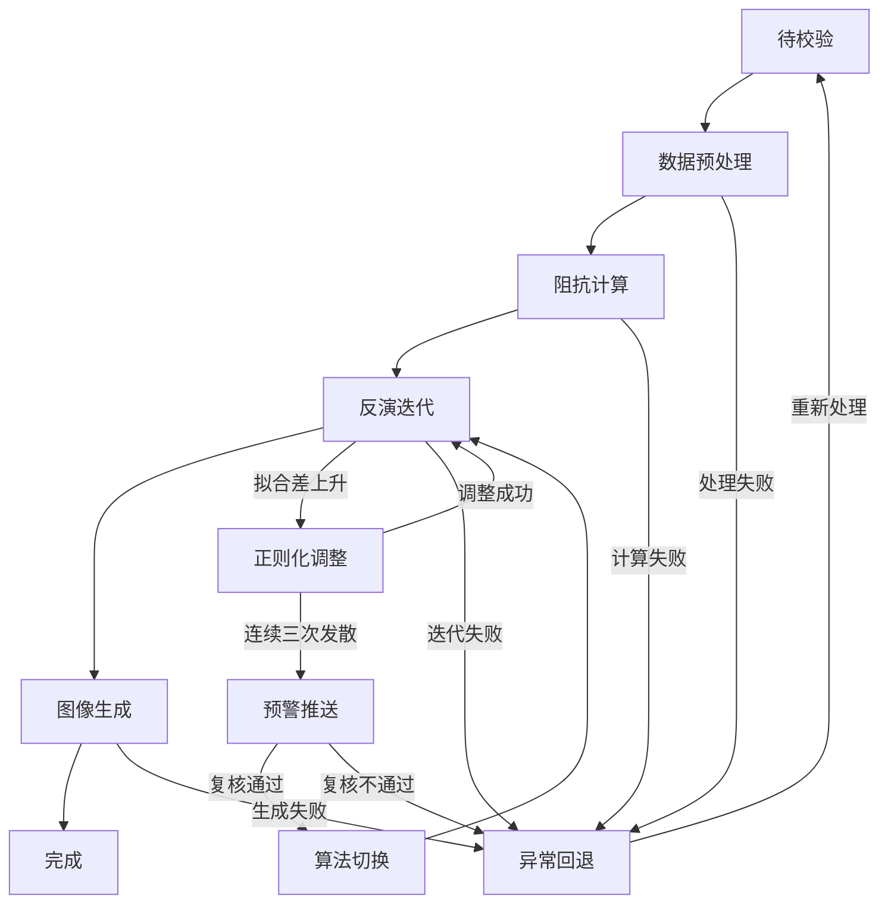
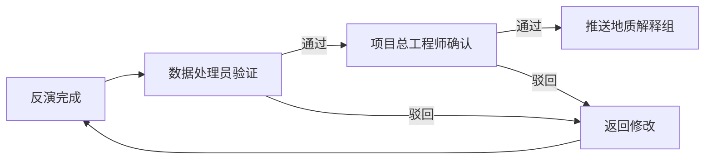
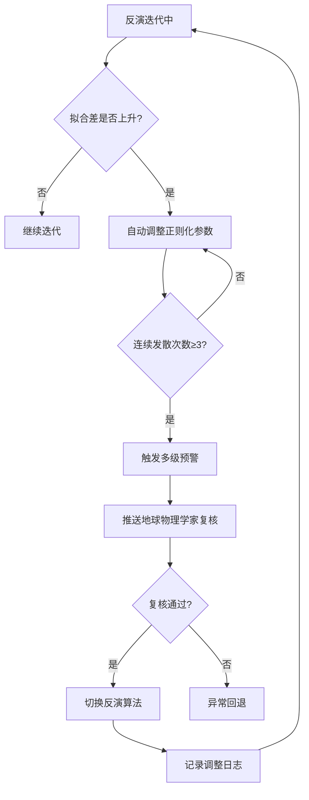

## 1. 产品概述

大地电磁测深数据反演与深部结构成像平台，面向地球物理勘探领域，提供从原始时间序列数据上传到三维反演成像的全流程自动化处理能力。系统集成了傅里叶变换、阻抗张量估计、远参考处理、三维非线性共轭梯度（NLCG）反演等核心算法，并配备智能推荐引擎、两级审批流程和多级预警机制，旨在大幅提升大地电磁数据处理的效率和可靠性。

- 目标用户：地球物理学家、数据处理员、项目总工程师、首席科学家
- 核心价值：将传统需要数周的手动反演流程压缩至数小时，通过智能推荐和自动监控降低人为失误，通过审批与预警机制保障成果质量

## 2. 核心功能

### 2.1 用户角色

| 角色 | 注册方式 | 核心权限 |
|------|----------|----------|
| 数据处理员 | 管理员分配账号 | 上传数据、启动反演任务、验证反演结果 |
| 项目总工程师 | 管理员分配账号 | 审批反演结果、查看综合报告、配置反演参数 |
| 首席科学家 | 管理员分配账号 | 处理假异常预警、暂停/恢复任务、查看全局看板 |
| 地质解释组 | 管理员分配账号 | 接收审批通过的成果、导出模型数据与反演曲线 |
| 系统管理员 | 系统内置 | 用户管理、系统配置、日志审计 |

### 2.2 功能模块

1. **工作台首页**：综合看板、任务概览、快捷入口、实时告警
2. **任务管理**：数据上传、任务列表、状态流转、反演监控
3. **反演监控**：拟合差曲线、模型粗糙度、迭代详情、正则化调整日志
4. **成果管理**：报告查看、深度切片浏览、灵敏度分布、置信区间、数据导出
5. **智能推荐**：初始模型推荐、正则化权重组合推荐、历史最优方案匹配
6. **审批中心**：两级审批流程、审批记录、成果推送
7. **预警管理**：多级预警列表、预警配置、处理记录、算法切换日志
8. **系统设置**：用户管理、测区管理、算法参数配置

### 2.3 页面详情

| 页面名称 | 模块名称 | 功能描述 |
|----------|----------|----------|
| 工作台首页 | 综合看板 | 每日完成率、反演收敛次数、拟合差改善率、性能趋势图 |
| 工作台首页 | 任务概览 | 各状态任务计数、最近任务列表、快捷操作 |
| 工作台首页 | 实时告警 | 发散预警、假异常预警、系统通知轮播 |
| 任务管理 | 数据上传 | 拖拽上传时间序列文件、文件格式校验、元数据提取 |
| 任务管理 | 任务列表 | 按状态/测区/日期筛选、批量操作、状态标签 |
| 任务管理 | 状态流转 | 待校验→数据预处理→阻抗计算→反演迭代→图像生成→完成/异常回退 |
| 反演监控 | 实时曲线 | 拟合差随迭代变化曲线、模型粗糙度变化曲线 |
| 反演监控 | 迭代详情 | 当前迭代参数、正则化参数调整记录、收敛判断 |
| 反演监控 | 预警触发 | 连续三次发散自动预警、推送通知、复核入口 |
| 成果管理 | 报告查看 | 综合PDF在线预览、下载 |
| 成果管理 | 深度切片浏览 | 电阻率深度切片交互式查看、多深度对比 |
| 成果管理 | 灵敏度分布 | 灵敏度分布图查看、区域筛选 |
| 成果管理 | 置信区间 | 置信区间包络线展示、统计信息 |
| 成果管理 | 数据导出 | 按测线/频段导出模型数据和反演曲线 |
| 智能推荐 | 模型推荐 | 基于历史数据推荐最优初始模型、推荐理由展示 |
| 智能推荐 | 权重推荐 | 正则化权重组合推荐、历史成功率对比 |
| 审批中心 | 待审批列表 | 数据处理员验证、项目总工程师确认 |
| 审批中心 | 审批记录 | 历史审批记录、审批意见、时间线 |
| 审批中心 | 成果推送 | 审批通过自动推送至地质解释组 |
| 预警管理 | 预警列表 | 活跃预警、已处理预警、假异常检测 |
| 预警管理 | 测区暂停 | 同一测区三次假异常自动暂停新任务 |
| 系统设置 | 用户管理 | 角色分配、权限配置 |
| 系统设置 | 测区管理 | 测区信息维护、关联任务 |
| 系统设置 | 算法配置 | 反演算法参数、预警阈值配置 |

## 3. 核心流程

### 3.1 反演任务全流程

用户上传大地电磁时间序列文件 → 系统校验文件格式与完整性（待校验） → 自动执行傅里叶变换与频谱分析（数据预处理） → 阻抗张量估计与远参考处理（阻抗计算） → 基于推荐初始模型启动三维NLCG反演（反演迭代） → 实时监控拟合差与模型粗糙度，拟合差上升时自动调整正则化参数，连续三次发散触发预警推送地球物理学家复核 → 复核通过后切换反演算法并记录日志 → 反演收敛后自动生成电阻率深度切片、灵敏度分布图、置信区间包络线（图像生成） → 生成综合报告PDF → 数据处理员验证 → 项目总工程师确认 → 推送至地质解释组（完成） → 若过程中出现异常则回退至对应阶段（异常回退）

### 3.2 状态流转图

### 3.3 审批流程

### 3.4 预警与暂停流程

## 4. 用户界面设计

### 4.1 设计风格

- **主色调**：深邃地质蓝 (#0A1628) 搭配地球物理橙 (#E8702A) 作为强调色，传达专业、深度的科研氛围
- **辅助色**：数据绿 (#22C55E) 表示收敛/正常，预警红 (#EF4444) 表示发散/异常，中性灰 (#64748B) 表示待处理
- **按钮风格**：圆角8px、中等阴影，主按钮使用橙色渐变，次按钮使用深蓝描边
- **字体**：标题使用 Noto Sans SC Bold，正文使用 Noto Sans SC Regular，数据展示使用 JetBrains Mono 等宽字体
- **布局风格**：左侧固定导航栏 + 顶部状态栏 + 主内容区域，卡片式布局，数据密集页面使用表格+图表组合
- **图表风格**：深色背景图表，渐变填充，发光数据线，科技感网格
- **图标风格**：线性图标，2px描边，与lucide-react图标库一致

### 4.2 页面设计概览

| 页面名称 | 模块名称 | UI元素 |
|----------|----------|--------|
| 工作台首页 | 综合看板 | 深色背景、顶部4个统计卡片（完成率/收敛次数/拟合差改善率/活跃预警数）、中部性能趋势折线图、底部最近任务时间线 |
| 工作台首页 | 任务概览 | 状态标签计数、环形进度图、最近5条任务快捷卡片 |
| 工作台首页 | 实时告警 | 右侧浮动告警面板、脉冲动画图标、颜色分级（橙/红） |
| 任务管理 | 数据上传 | 居中拖拽区域、虚线边框、上传进度条、文件列表表格 |
| 任务管理 | 任务列表 | 高级筛选栏、状态标签（彩色药丸形）、分页表格、行操作按钮 |
| 反演监控 | 实时曲线 | 双Y轴折线图（拟合差+粗糙度）、迭代标记点、实时更新动画 |
| 反演监控 | 迭代详情 | 左侧参数面板、右侧日志流、底部调整记录时间线 |
| 成果管理 | 报告查看 | PDF内嵌预览、工具栏（下载/打印/分享）、侧边目录导航 |
| 成果管理 | 深度切片浏览 | 色标图例、深度滑块、多切片并排对比、热力图叠加 |
| 智能推荐 | 模型推荐 | 推荐卡片、匹配度百分比、历史成功率柱状图、一键应用按钮 |
| 审批中心 | 待审批列表 | 审批卡片、通过/驳回按钮、意见输入框、审批时间线 |
| 预警管理 | 预警列表 | 预警等级标签、测区信息、处理状态、操作按钮 |

### 4.3 响应式设计

- 桌面优先设计，最小支持1280px宽度
- 1920px以上充分利用空间展示更多数据列和图表
- 1280-1920px自适应缩放，图表保持可读性
- 关键操作按钮始终可见，次要信息可折叠

### 4.4 动效设计

- 页面切换：淡入淡出 200ms
- 卡片悬停：轻微上浮 + 阴影加深
- 状态变化：颜色渐变过渡 300ms
- 实时数据更新：数字滚动动画
- 预警触发：脉冲呼吸灯效果
- 图表加载：从左到右绘制动画
