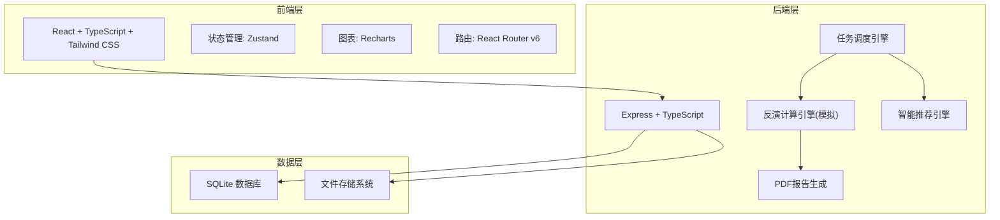
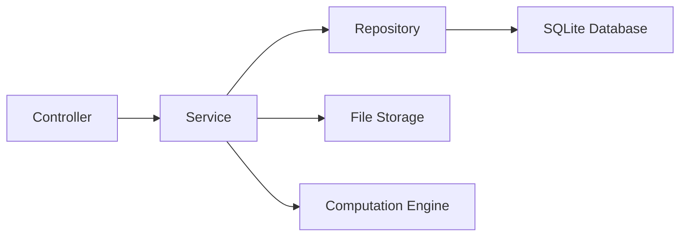
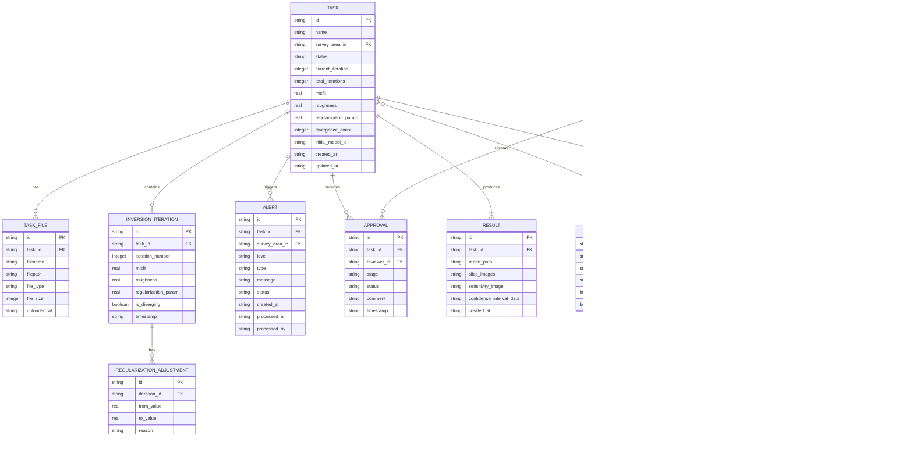

## 1. 架构设计



## 2. 技术说明

- **前端**: React@18 + TypeScript + Tailwind CSS@3 + Vite
- **初始化工具**: vite-init
- **后端**: Express@4 + TypeScript (ESM)
- **数据库**: SQLite (better-sqlite3)
- **图表库**: Recharts
- **PDF生成**: 前端html2canvas + jsPDF
- **状态管理**: Zustand
- **路由**: React Router v6
- **图标**: lucide-react
- **字体**: Noto Sans SC + JetBrains Mono

## 3. 路由定义

| 路由 | 用途 |
|------|------|
| / | 工作台首页 - 综合看板与任务概览 |
| /tasks | 任务管理 - 任务列表与数据上传 |
| /tasks/:id | 任务详情 - 反演监控与状态流转 |
| /results | 成果管理 - 报告与数据导出 |
| /results/:id | 成果详情 - 深度切片/灵敏度/置信区间 |
| /recommend | 智能推荐 - 初始模型与权重推荐 |
| /approval | 审批中心 - 两级审批流程 |
| /alerts | 预警管理 - 预警列表与处理 |
| /settings | 系统设置 - 用户/测区/算法配置 |

## 4. API 定义

### 4.1 任务相关

```typescript
interface MTTask {
  id: string
  name: string
  surveyArea: string
  status: "pending_check" | "preprocessing" | "impedance_calc" | "inversion_iter" | "image_gen" | "completed" | "rollback"
  files: string[]
  createdAt: string
  updatedAt: string
  currentIteration: number
  totalIterations: number
  misfit: number
  roughness: number
  regularizationParam: number
  divergenceCount: number
  alertLevel: "none" | "warning" | "critical"
}

interface TaskListResponse {
  tasks: MTTask[]
  total: number
  page: number
  pageSize: number
}

interface CreateTaskRequest {
  name: string
  surveyArea: string
  files: File[]
  initialModelId?: string
  regularizationWeight?: number
}
```

### 4.2 反演监控

```typescript
interface InversionProgress {
  taskId: string
  iteration: number
  misfit: number
  roughness: number
  regularizationParam: number
  timestamp: string
  isDiverging: boolean
}

interface RegularizationAdjustment {
  taskId: string
  fromValue: number
  toValue: number
  reason: string
  timestamp: string
}

interface AlgorithmSwitch {
  taskId: string
  fromAlgorithm: string
  toAlgorithm: string
  approvedBy: string
  reason: string
  timestamp: string
}
```

### 4.3 审批相关

```typescript
interface Approval {
  id: string
  taskId: string
  stage: "data_verifier" | "chief_engineer"
  status: "pending" | "approved" | "rejected"
  reviewer: string
  comment: string
  timestamp: string
}
```

### 4.4 预警相关

```typescript
interface Alert {
  id: string
  taskId: string
  surveyArea: string
  level: "warning" | "critical"
  type: "divergence" | "false_anomaly" | "system"
  message: string
  status: "active" | "processed" | "dismissed"
  createdAt: string
  processedAt?: string
  processedBy?: string
}
```

### 4.5 智能推荐

```typescript
interface ModelRecommendation {
  id: string
  modelName: string
  matchScore: number
  historicalSuccessRate: number
  parameters: Record<string, number>
  reason: string
}

interface WeightRecommendation {
  id: string
  weightCombination: string
  regularizationWeight: number
  smoothnessWeight: number
  successRate: number
  avgConvergenceIter: number
}
```

### 4.6 看板统计

```typescript
interface DashboardStats {
  completionRate: number
  convergenceCount: number
  misfitImprovementRate: number
  activeAlerts: number
  dailyStats: {
    date: string
    completedTasks: number
    convergenceIterations: number
    avgMisfitImprovement: number
  }[]
  taskStatusDistribution: Record<string, number>
}
```

## 5. 服务器架构图



### 5.1 Controller层
- taskController: 任务CRUD、状态流转
- inversionController: 反演监控、参数调整
- approvalController: 审批流程管理
- alertController: 预警管理
- recommendController: 智能推荐
- dashboardController: 看板数据

### 5.2 Service层
- taskService: 任务业务逻辑、状态机
- inversionService: 反演模拟、拟合差计算
- approvalService: 两级审批、推送通知
- alertService: 预警检测、阈值判断
- recommendService: 历史匹配、推荐算法
- dashboardService: 统计聚合、趋势计算

### 5.3 Repository层
- taskRepo: 任务数据访问
- resultRepo: 成果数据访问
- approvalRepo: 审批记录访问
- alertRepo: 预警数据访问
- historyRepo: 历史反演结果访问

## 6. 数据模型

### 6.1 数据模型定义



### 6.2 数据定义语言

```sql
CREATE TABLE role (
    id TEXT PRIMARY KEY,
    name TEXT NOT NULL UNIQUE,
    permissions TEXT NOT NULL
);

CREATE TABLE user (
    id TEXT PRIMARY KEY,
    username TEXT NOT NULL UNIQUE,
    role_id TEXT NOT NULL REFERENCES role(id),
    email TEXT NOT NULL,
    created_at TEXT NOT NULL DEFAULT (datetime('now'))
);

CREATE TABLE survey_area (
    id TEXT PRIMARY KEY,
    name TEXT NOT NULL,
    description TEXT,
    coordinates TEXT,
    consecutive_false_anomaly_count INTEGER NOT NULL DEFAULT 0,
    is_paused INTEGER NOT NULL DEFAULT 0
);

CREATE TABLE task (
    id TEXT PRIMARY KEY,
    name TEXT NOT NULL,
    survey_area_id TEXT NOT NULL REFERENCES survey_area(id),
    status TEXT NOT NULL DEFAULT 'pending_check',
    current_iteration INTEGER NOT NULL DEFAULT 0,
    total_iterations INTEGER NOT NULL DEFAULT 50,
    misfit REAL NOT NULL DEFAULT 0.0,
    roughness REAL NOT NULL DEFAULT 0.0,
    regularization_param REAL NOT NULL DEFAULT 1.0,
    divergence_count INTEGER NOT NULL DEFAULT 0,
    initial_model_id TEXT,
    created_at TEXT NOT NULL DEFAULT (datetime('now')),
    updated_at TEXT NOT NULL DEFAULT (datetime('now'))
);

CREATE TABLE task_file (
    id TEXT PRIMARY KEY,
    task_id TEXT NOT NULL REFERENCES task(id),
    filename TEXT NOT NULL,
    filepath TEXT NOT NULL,
    file_type TEXT NOT NULL,
    file_size INTEGER NOT NULL,
    uploaded_at TEXT NOT NULL DEFAULT (datetime('now'))
);

CREATE TABLE inversion_iteration (
    id TEXT PRIMARY KEY,
    task_id TEXT NOT NULL REFERENCES task(id),
    iteration_number INTEGER NOT NULL,
    misfit REAL NOT NULL,
    roughness REAL NOT NULL,
    regularization_param REAL NOT NULL,
    is_diverging INTEGER NOT NULL DEFAULT 0,
    timestamp TEXT NOT NULL DEFAULT (datetime('now'))
);

CREATE TABLE regularization_adjustment (
    id TEXT PRIMARY KEY,
    iteration_id TEXT NOT NULL REFERENCES inversion_iteration(id),
    from_value REAL NOT NULL,
    to_value REAL NOT NULL,
    reason TEXT NOT NULL,
    timestamp TEXT NOT NULL DEFAULT (datetime('now'))
);

CREATE TABLE algorithm_switch (
    id TEXT PRIMARY KEY,
    task_id TEXT NOT NULL REFERENCES task(id),
    from_algorithm TEXT NOT NULL,
    to_algorithm TEXT NOT NULL,
    approved_by TEXT REFERENCES user(id),
    reason TEXT NOT NULL,
    timestamp TEXT NOT NULL DEFAULT (datetime('now'))
);

CREATE TABLE result (
    id TEXT PRIMARY KEY,
    task_id TEXT NOT NULL UNIQUE REFERENCES task(id),
    report_path TEXT,
    slice_images TEXT,
    sensitivity_image TEXT,
    confidence_interval_data TEXT,
    created_at TEXT NOT NULL DEFAULT (datetime('now'))
);

CREATE TABLE approval (
    id TEXT PRIMARY KEY,
    task_id TEXT NOT NULL REFERENCES task(id),
    reviewer_id TEXT NOT NULL REFERENCES user(id),
    stage TEXT NOT NULL,
    status TEXT NOT NULL DEFAULT 'pending',
    comment TEXT,
    timestamp TEXT NOT NULL DEFAULT (datetime('now'))
);

CREATE TABLE alert (
    id TEXT PRIMARY KEY,
    task_id TEXT NOT NULL REFERENCES task(id),
    survey_area_id TEXT REFERENCES survey_area(id),
    level TEXT NOT NULL,
    type TEXT NOT NULL,
    message TEXT NOT NULL,
    status TEXT NOT NULL DEFAULT 'active',
    created_at TEXT NOT NULL DEFAULT (datetime('now')),
    processed_at TEXT,
    processed_by TEXT REFERENCES user(id)
);

CREATE TABLE history_model (
    id TEXT PRIMARY KEY,
    task_id TEXT REFERENCES task(id),
    model_name TEXT NOT NULL,
    parameters TEXT NOT NULL,
    success_rate REAL NOT NULL,
    avg_convergence_iter REAL NOT NULL,
    survey_type TEXT NOT NULL
);

INSERT INTO role (id, name, permissions) VALUES
    ('r1', '数据处理员', 'upload,verify,export'),
    ('r2', '项目总工程师', 'approve,configure,report'),
    ('r3', '首席科学家', 'alert,pause,dashboard'),
    ('r4', '地质解释组', 'view,export,interpret'),
    ('r5', '系统管理员', 'manage_users,configure,audit');

INSERT INTO user (id, username, role_id, email) VALUES
    ('u1', '张明', 'r1', 'zhangming@mt-platform.cn'),
    ('u2', '李工', 'r2', 'ligong@mt-platform.cn'),
    ('u3', '王首席', 'r3', 'wangchief@mt-platform.cn'),
    ('u4', '赵解释', 'r4', 'zhaojie@mt-platform.cn'),
    ('u5', '管理员', 'r5', 'admin@mt-platform.cn');

INSERT INTO survey_area (id, name, description, coordinates) VALUES
    ('sa1', '青藏高原东缘测区', '川西-藏东深部电性结构探测', '30.0N-32.0N, 100.0E-103.0E'),
    ('sa2', '华北克拉通测区', '华北克拉通破坏深部过程研究', '36.0N-40.0N, 114.0E-118.0E'),
    ('sa3', '南海北部陆缘测区', '南海北部深水区地壳结构探测', '18.0N-22.0N, 112.0E-117.0E');
```
